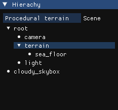
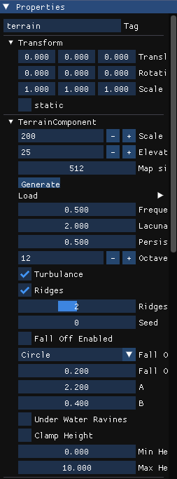
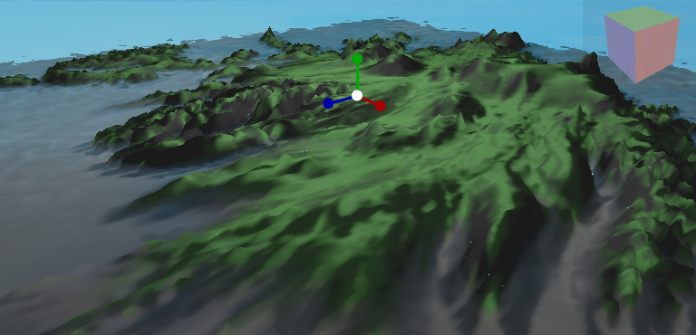
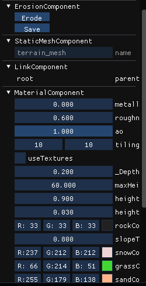
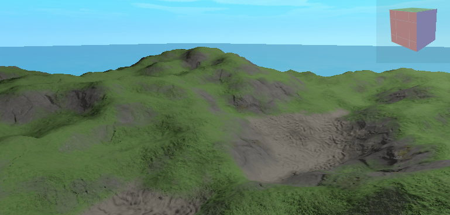
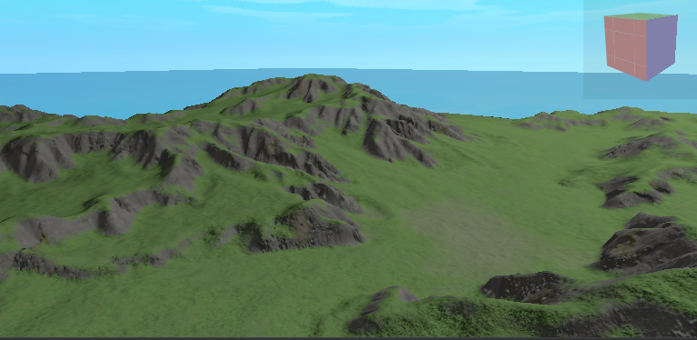

## Getting Started

To begin, run the `example_3_9_procedural_terrain_generation` script within a `pyGandalf` Python environment (refer to the pyGandalf README for installation instructions).

### Terrain Generation

1. In the **Hierarchy** window, select the `root/terrain` entity:

   

2. In the **Properties** window, click the **Generate** button to create terrain:

   

- **Scale** determines the overall terrain size.
- **Map Size** controls the resolution of the heightmap.
- The remaining parameters adjust the noise settings—experiment with these to modify terrain features.

You can also load heightmaps as textures from the `resources/textures` folder using the **Load** list.

### Example: Iceland Heightmap

An example using a heightmap of Iceland:

### Erosion Simulation

Click the **Erode** button in the **Erosion** component to simulate erosion. This simulates one droplet per terrain point, with 500 simulation steps each.

Click **Save** to store the current heightmap:

### Material and Shading

In the **Material** component, you can adjust shading parameters. Note that the **metallic**, **roughness**, and **ambient occlusion (AO)** values affect shading only when using color-based shading (not textures).

Example: A procedurally generated terrain with texture shading and subsequent erosion:

  

## Camera Controls

- Use **WASD** keys and **right-click + mouse movement** to navigate the scene.